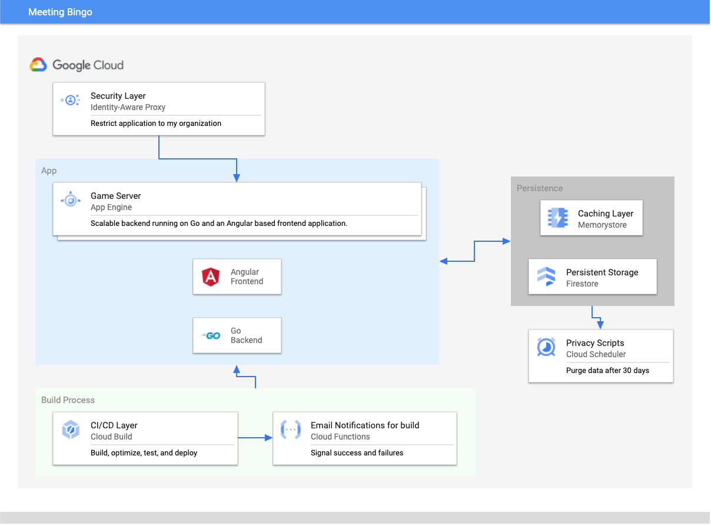

# Buzzword Bingo

This project is an open source version of a Buzzword Bingo game for meetings. 
The idea is to make the litany of meetings that we do more engaging. 

## The Setup

This app takes advantage of several connected Google Cloud and Google Open 
Source technologies. 

|    |            |
|----------|:-------------|
| **Database** |  Firestore |
| **Backend Server** | Go running on App Engine with Memorystore (redis) as a cache.    |
| **Frontend App** | Angular |
| **Security** | Identity Aware Proxy |
| **Build Chain** | Github to Cloud Build |
 

## Getting started

### Dependencies
* make
* [gcloud cli](https://cloud.google.com/sdk/gcloud)
* [firebase cli](https://firebase.google.com/docs/cli)
* [docker](https://docs.docker.com/get-docker/)
* [npm](https://www.npmjs.com/get-npm)
* [ng cli](https://cli.angular.io/)
* [go](https://golang.org/dl/)
 
### Setup script

* Create a Google Cloud Project
* Set environmental variable `BINGO_PROJECT_ID` with project id of your project.
* Perform multiple tasks by running `make project init`
* [Upgrade Firestore to Native Mode](https://cloud.google.com/datastore/docs/upgrade-to-firestore)
* [Setup Oauth on Project](https://support.google.com/cloud/answer/6158849?hl=en) 
* Set environmental variable `BINGO_OAUTH_ID` value given in IAP console.
* Set environmental variable `BINGO_OAUTH_SECRET` value given in IAP console.  
* Eanble IAP by runninbg `make secure`
* Initilize project using Firestore CLI
* Make copies of `frontend/src/environments/sample.environment.ts` and `frontend/src/environments/sample.environment.prod.ts` named `frontend/src/environments/environment.ts` and `frontend/src/environments/environment.prod.ts`
* Download Firebase config and copy into  `frontend/src/environments/environment.ts`
* Repeat for `frontend/src/environments/environment.prod.ts`

## Development server

Run `make dev` for a dev server. Navigate to `http://localhost:4200/`. The app will automatically reload if you change any of the js source files. If you update the Golang code, you will have to break out and rerun `make dev`

## Deploy to production

`make deploy`

## Optional Components
### Firestore emulator for testing
In order to test you need to setup and install the Firestore emulator, which 
requires the JDK to be installed. 

[Firestore Emulator](https://firebase.google.com/docs/rules/emulator-setup)

### Cloud Build
Setup a CLI pipeline on a git repo that runs a Cloud Build job to deploy to 
App Engine. There is a cloudbuild.yaml setup and a builder directory available 
for doing that.  To do this, you need to run
`make builders` and `make savecreds`

Then you can run Cloud Build deploys using `make build`

### Cloud Functions
Readup on [sending Cloud Build notifications using Mailgun](https://cloud.google.com/cloud-build/docs/configure-third-party-notifications#email_notifications). 
Setup `/functions/email/config.json` based on the sample file there. 

Then run `make function`

### Cloud Scheduler
Purge the system of games, boards, and most importantly, emails older than 30 days. 

Set this up by running `make schedule`

This is not an official Google product. 